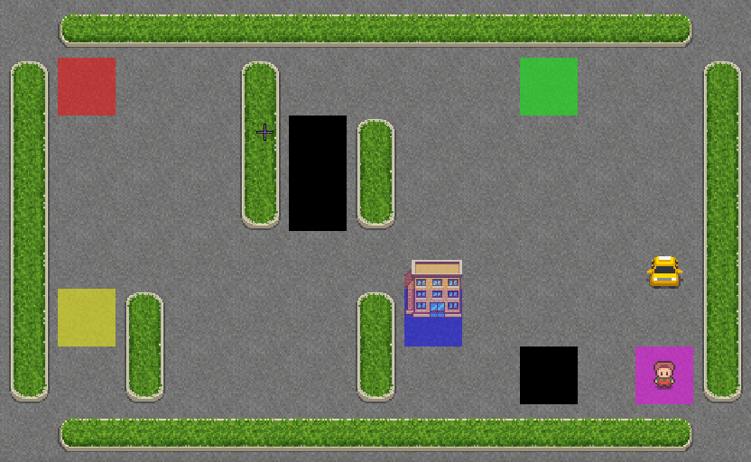
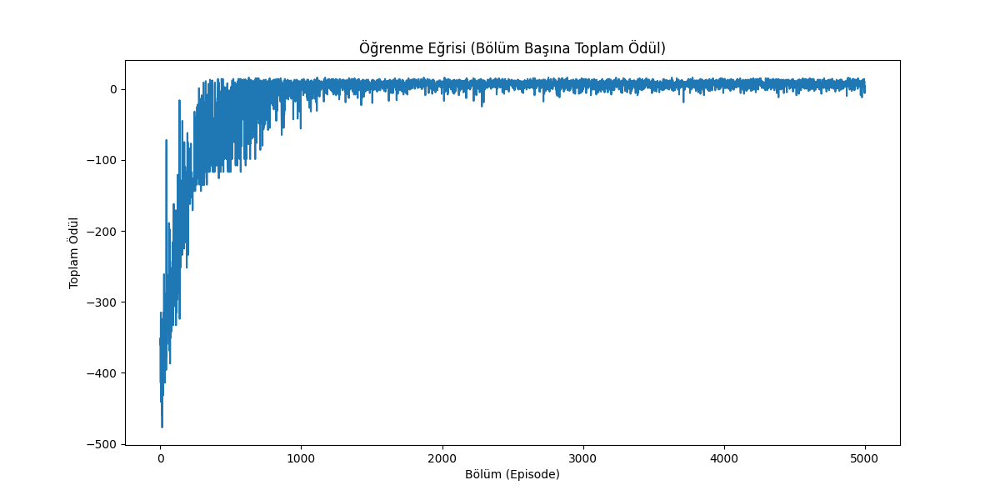
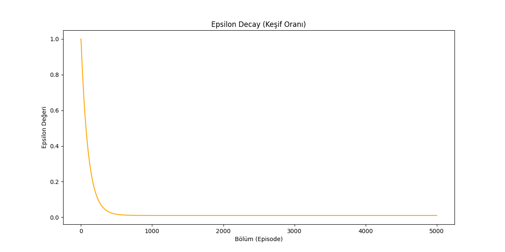

# DRLHV-1: Customizing the OpenAI Gym Taxi Environment

## 📌 Project Overview
This project involves a significant customization of the standard **Taxi-v3** environment from the OpenAI Gym library.

As stated in the original documentation, I changed some **parameters** on the **gym** library (especially the `taxi.py` file) which was published by **OpenAI**. **Differences** emerge around map size, station count, new **obstacles**, etc. For real learning and having a deep **intuitive** approach, I changed some of these values and also some of the **affected** functions.

## 🛠 Environment Modifications
I directly modified the source code to alter the fundamental mechanics of the environment:

* **Map Size:** The grid was expanded from the standard **5x5** to **6x6**.
* **Station Count:** The number of pickup/drop-off stations was increased from **4 to 5**.
* **New Obstacles:** Added a new obstacle **"X"** / **"BLACK SQUARES"** as an **unmovable** part of the grid to increase navigation complexity.

## 🤯 Challenges & Observations
The **hardest** part was the **Render** part because a lot of **things** were **affected** when the map size changed. These changes **required** some **function** changes, mostly due to static coding, which also **surprised** me.

> "...I **didn't** expect such a basic coding approach (e.g., static values like '5' **representing** row size when we also have a row-size variable???) from OpenAI."

## 🧠 Methodology: Q-Learning
The agent solves this custom environment using **Tabular Q-Learning**. It learns an optimal policy by iteratively updating a Q-Table based on rewards.

### Data Persistence
I need to keep the **training** data as both a **CSV** file for humans and an **NPY** file for machines. So I coded basic Python **structures** to keep the files and, if **needed**, read the file.

## ⚙️ Hyperparameters
The following configurations were used in `RL.py` to train the agent:

| Parameter | Value | Description |
| :--- | :--- | :--- |
| **Episodes** | 5000 | Total number of training rounds. |
| **Max Steps** | 99 | Maximum allowed steps per episode. |
| **Learning Rate ($\alpha$)** | 0.7 | Step size for updating Q-values. |
| **Discount Rate ($\gamma$)** | 0.618 | Importance of future rewards (Golden Ratio). |
| **Epsilon (Start)** | 1.0 | Initial exploration rate (100% random). |
| **Decay Rate** | 0.01 | Exponential decay factor for epsilon. |

## 📊 Results & Performance Analysis

The agent successfully learned to navigate the custom 6x6 grid, avoiding static obstacles and optimizing the delivery route. Below are the visual and analytical results of the training process.

### 1. Visual Simulation
The trained agent performing a perfect run (picking up the passenger and dropping them off at the destination without hitting obstacles):

<p align="center">
  
</p>

### 2. Learning Curve (Rewards over Episodes)
The graph below demonstrates the agent's learning progress over 5,000 episodes.

<p align="center">
  
</p>

**Interpretation:**
* **Early Phase (Episodes 0-1500):** The rewards are highly volatile and mostly negative. This is the *exploration phase* where the agent makes random moves (high Epsilon) and frequently hits walls or takes too long steps.
* **Convergence (Episodes 2000+):** As the agent updates its Q-Table, the reward stabilizes at a positive maximum value. This indicates the agent has learned the optimal policy.

### 3. Exploration Strategy (Epsilon Decay)
We used an Epsilon-Greedy strategy to balance exploration and exploitation.

<p align="center">
  
</p>

* **Decay Rate:** The epsilon value decays exponentially. By the end of the training, the agent acts almost entirely based on its learned experience (Exploitation), minimizing random actions.

### Summary
The correlation between the **decrease in Epsilon** and the **increase in Rewards** proves the effectiveness of the Q-Learning algorithm in this custom environment. The agent transitions from "random guessing" to "optimal navigation" successfully.

## 🚀 Setup
```bash
git clone https://github.com/MuhammetAliKaya/DRLHV-1.git
cd DRLHV-1
python -m venv .venv
.\.venv\Scripts\Activate
pip install "numpy<2" gym pygame
python RL.py


press [e]     or     [h]
press [enter]
```